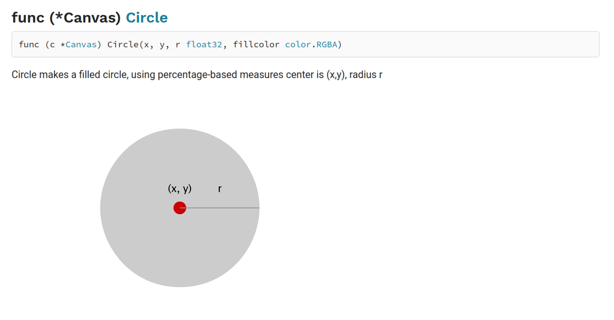

# Proposal: illustrations in Go documentation pages

Author(s): Anthony J. Starks

Last updated: 2020-10-01

Discussion at https://golang.org/issue/39513.

## Abstract

To improve understanding, the Go documentation format should support adding optional illustrations.

## Background

Currently the Go documentation conventions used by the ```go doc``` and the [Go package site](https://pkg.go.dev/) are text-only. The improve understanding, and improve package adoption and usage, package documentaion would be enchanced with the addition of illustrations. Graphics packages, or packages that use intricate algorithms and data structures are ideal candidates for illustrations.

It is important to note that this proposal is intended to  enhance the existing documentation systems and the addition of ilustrations is solely at the discretion of the package maintanters.

## Proposal

Package authors may add optional directives to package comments that allow the rendering of illustrations along with the text found in the comments. Illustration directives outside of documentation comments will be ignored.
The addition of an illustration is triggered by this directive:

```
//godoc:image [alt text](reference to illustration)
```

The syntax is similar to [Markdown](https://daringfireball.net/projects/markdown/), and may be safely ignored when rendering in environments where graphics are not typically used (for example on some terminals).
The illustration reference may be local (the illustration asset is at the same location as the code), or it may refer to a URL.
The agent rendering the documentation may also decide to render the alternative text as appropriate -- for example when using screen readers.

The supported image formats are those commonly supported in modern web browsers (JPEG, PNG, GIF and SVG).

Here is an example:

```
// Circle makes a filled circle, using percentage-based measures center at (x, y), radius r
//godoc:image [illustration of circle centered at (x,y) indicated with a red dot, filled with gray](circle.png)
func (* Canvas) Circle(x, y, r float32, fillcolor color.RGBA)
```

would be rendered like this on a web-based system like go.dev



```go  doc``` will continue to render as before:

```
$ go  doc giocanvas.Circle
package giocanvas // import "github.com/ajstarks/giocanvas"

func (c *Canvas) Circle(x, y, r float32, fillcolor color.RGBA)
    Circle makes a filled circle, using percentage-based measures center is
    (x,y), radius r
```

It is possible to add multiple illustration directives, but illustrations must be proceeded by text comments.

Illustrations may also be placed at the package level, and in this case, are rendered at the top of the documentation.

```
// Package giocanvas is a 2D canvas API built on gio
//godoc:image [overview illustration](overview.png)
package giocanvas
...
//
// more docs
```

## Rationale

Package users will have differing preferences for learning and absorbing material, and adding illustrations will help those that prefer a visual approach, and some packages lend themselves to illustrations. 

Note that adding illustrations is purely at the discretion of the package maintainers, and the quality and suitabilty of the illustrations is their responsibility alone. 
Additionally, package authors must also make sure that the text of the documentation and are kept in sync.

Package authors may be tempted to provide illustration-only documents, adversely effecting users in non-browser environments.
One possible mitigation is for linting tools to recognize and discourage "illustration-only" comments. 
Here are some guidelines for effective package illustrations:

* Illustrations should enhance the written documentation, and not be gratuitious
* When using illustration labels, use the same names as used code
* Illustrations should be not too large or overwhelming
* Use targeted use of animation to enhance understanding
* Be consistent -- illustrate related functions and methods collectively

## Compatibility

Compatibility will be maintained by ignoring the directives in cases where it is not appropriate to show them. Note that no changes are required for ```cmd/go```.

## Implementation

To implement this proposal, the authors of ```golang.org/x/pkgsite``` and the go tool must add the capability to process (or ignore) the godoc directive. Also, Good documentation practices should be communicated to package maintainers.  This proposal may be implemented at any time the maintainers deem appropriate. It would be advantageous to coordinate this activity with any other active developement (for example during updates to the x/pkgsite)

## Open issues (if applicable)

The size of the illustrations may be limited by the agent displaying them, or may otherwise be optimized or limited. The mechanism for this scaling is not defined.